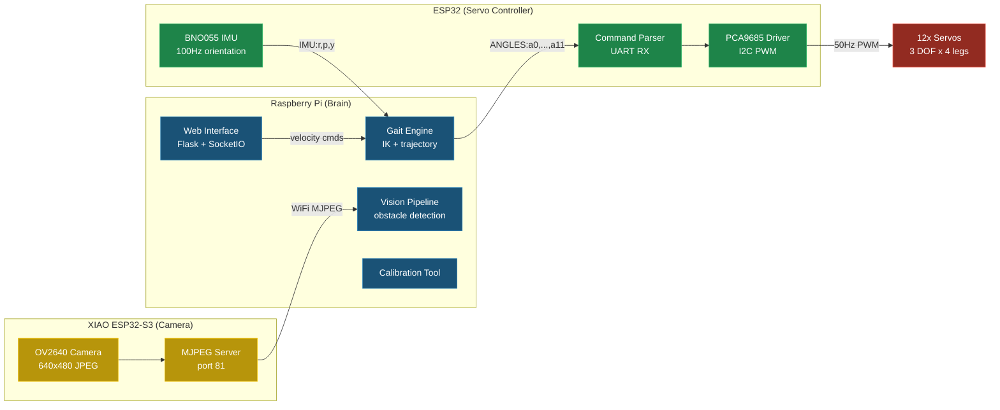
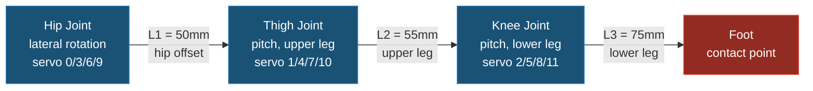
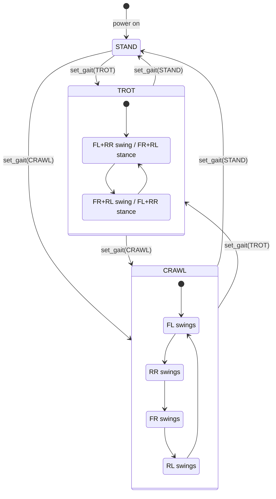
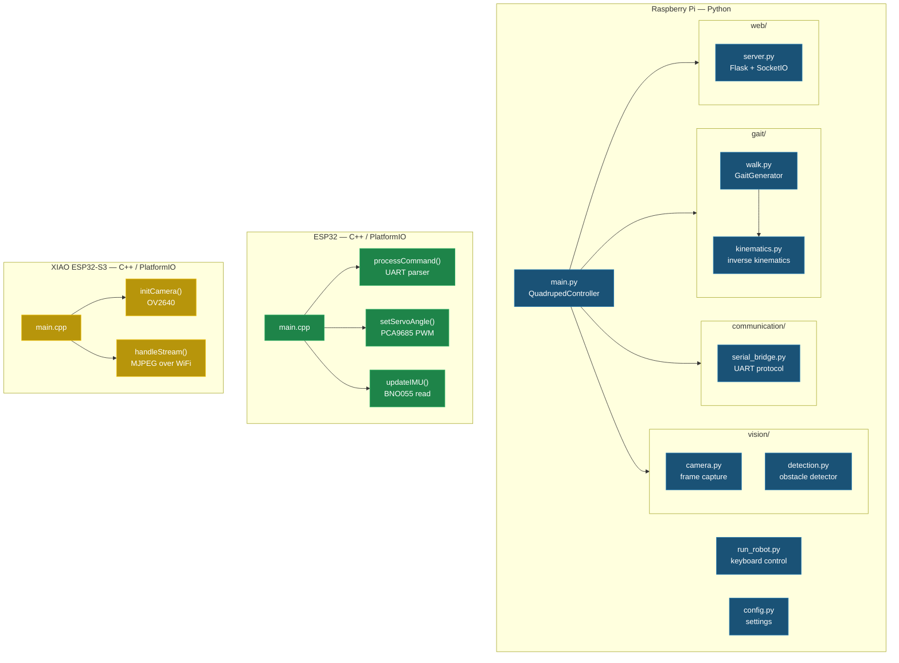
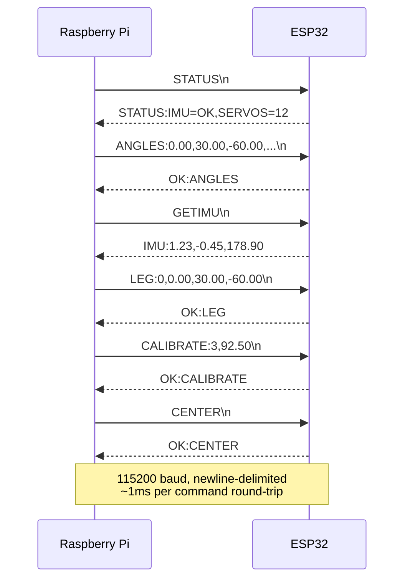
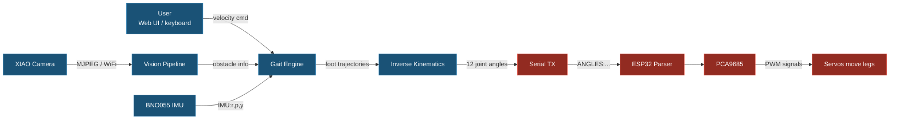

# QuadRupedDog

> Quadruped walking robot with distributed three-node architecture — Raspberry Pi brain, ESP32 real-time servo control, XIAO ESP32-S3 camera module.

## Why This Architecture

Quadruped robots that combine gait computation, computer vision, and servo control on a single microcontroller hit hard real-time limits. Python-based gait planning and OpenCV processing need milliseconds of compute headroom, while servo PWM signals demand microsecond-precision timing. Running both on one chip means either the gait loop jitters or the PWM generation stutters — neither is acceptable for stable locomotion.

This project separates concerns across three compute nodes matched to their timing requirements. The Raspberry Pi runs Python for gait generation, inverse kinematics, vision processing, and a web control interface — tasks that benefit from a full OS, floating-point math libraries, and network stack. The ESP32 handles nothing but real-time servo control: it receives joint angle commands over serial and translates them into 50Hz PWM signals via a PCA9685 driver, plus reads a BNO055 IMU at 100Hz for orientation feedback. The XIAO ESP32-S3 Sense streams camera frames over WiFi, offloading image capture I/O from the main controller.

The tradeoff is communication latency between nodes. Serial commands from Pi to ESP32 add ~1ms of overhead per update cycle. In practice this is negligible compared to the 20ms servo update period (50Hz), and the architecture guarantees that neither vision processing delays nor gait computation spikes can starve the servo timing loop.

## Architecture

### System Overview

Three compute nodes connected by serial (Pi↔ESP32) and WiFi (Pi↔XIAO). The Pi acts as the central brain — it plans, the ESP32 executes, and the XIAO observes.



### Leg Kinematics

Each leg has 3 degrees of freedom. The hip joint rotates the leg laterally on the body plate. The thigh (shoulder) joint pitches the upper leg segment. The knee joint pitches the lower leg segment. Inverse kinematics computes joint angles from a desired foot position using geometric solution with law of cosines.



### Gait State Machine

The gait controller transitions between standing and walking modes. In walking gaits, each leg cycles through stance (foot on ground, pushing backward) and swing (foot in air, moving forward) phases with configurable phase offsets.



### Software Architecture

Internal module structure for each compute node. The Pi code is organized as a Python package with submodules for each subsystem.



### Communication Protocol

The Pi and ESP32 communicate over USB serial at 115200 baud using a text-based request/response protocol. Commands are newline-terminated ASCII strings. The ESP32 acknowledges every command or returns an error code.



### Data Flow

A complete control cycle from user input through mechanical output and optional visual feedback.



## Hardware BOM

| Component | Model | Qty | Role |
|-----------|-------|-----|------|
| SBC | Raspberry Pi 4/5 | 1 | Brain — gait, vision, web UI |
| MCU | ESP32-DevKitC | 1 | Real-time servo control + IMU |
| Camera MCU | XIAO ESP32-S3 Sense | 1 | Camera streaming over WiFi |
| PWM Driver | PCA9685 16-ch I2C | 1 | Drives all 12 servos |
| IMU | BNO055 9-DOF | 1 | Orientation feedback |
| Servos | Standard hobby servos (50Hz, 500-2500μs) | 12 | 3 DOF per leg × 4 legs |
| Power Supply | 5V regulated, ≥5A | 1 | Servo power |
| Logic Level | 3.3V↔5V (if needed) | 1 | Pi↔ESP32 UART level match |
| Frame | 3D-printed or laser-cut | 1 | Robot chassis |

## Mechanical Design

Four-legged robot with 3 degrees of freedom per leg. Body dimensions: 140mm (front-to-rear) × 80mm (left-to-right) between hip joints. Each leg consists of a hip segment (50mm offset), thigh (55mm), and shin (75mm), giving a total leg reach of approximately 130mm. Default standing height is 80mm from ground to shoulder axis.

Servo mounting: hip servos mount flat on the body plate for lateral rotation, thigh and knee servos mount perpendicular for pitch motion. Right-side servos are direction-mirrored in firmware.

## Software Stack

### Raspberry Pi (Python)

- **Gait Engine** (`gait/walk.py`) — Trot and crawl gait patterns with configurable phase offsets, cycle time, step length/height, and duty factor. Maintains a phase clock and generates per-leg foot trajectories each tick.
- **Inverse Kinematics** (`gait/kinematics.py`) — Geometric 3-DOF IK solver using law of cosines. Computes hip, thigh, and knee angles from desired foot positions. Includes forward kinematics for verification.
- **Communication** (`communication/serial_bridge.py`) — Threaded serial bridge over USB/UART at 115200 baud. Sends angle commands, parses IMU responses, supports callbacks for asynchronous IMU updates.
- **Vision** (`vision/`) — OpenCV-based obstacle detection using Canny edge detection and contour analysis. Camera module supports USB cameras, Pi Camera, and MJPEG WiFi streams from the XIAO. Autonomous obstacle avoidance adjusts velocity based on detected obstacle distance and direction.
- **Web Interface** (`web/server.py`) — Flask + Flask-SocketIO server with a touch-friendly mobile control UI. D-pad for movement, gait selector, real-time IMU telemetry display. WebSocket-based for low-latency control.
- **Calibration** (`calibrate.py`) — Interactive terminal tool for zeroing servo positions. Adjust each servo ±1°/±5°, set center offsets, export offset array for ESP32 firmware.

### ESP32 (C++ / PlatformIO)

- **Servo Controller** — PCA9685 I2C PWM driver at address 0x40. Converts angle commands to pulse widths (500-2500μs) with per-servo direction mirroring and calibration offsets. 12 channels mapped to 4 legs × 3 joints.
- **Command Parser** — Serial RX loop with 256-byte buffer. Parses newline-terminated ASCII commands (ANGLES, SERVO, LEG, CENTER, GETIMU, CALIBRATE, STATUS). Returns OK/ERR acknowledgements.
- **IMU Interface** — BNO055 9-DOF IMU over I2C at address 0x28. Reads Euler angles at 100Hz. Sends roll/pitch/yaw on request.

### XIAO ESP32-S3 (C++ / PlatformIO)

- **Camera Module** — OV2640 sensor with PSRAM buffer. Captures VGA (640×480) JPEG frames. Serves MJPEG stream on port 81 via HTTP WebServer. Single-frame snapshot endpoint at `/capture`.

## Getting Started

### Prerequisites

- Raspberry Pi 4/5 with Python 3.9+
- PlatformIO CLI (`pip install platformio`)
- Hardware assembled and wired per pin mapping below

### 1. Flash the ESP32

```bash
cd esp32_servo_controller
pio run --target upload
pio device monitor  # verify "Ready!" message
```

### 2. Flash the XIAO Camera

Edit `xiao_camera/src/main.cpp` — set `WIFI_SSID` and `WIFI_PASSWORD` for your network.

```bash
cd xiao_camera
pio run --target upload
pio device monitor  # note the IP address printed on connect
```

### 3. Set Up the Raspberry Pi

```bash
cd raspberry_pi
sudo bash setup_pi.sh
source venv/bin/activate
```

### 4. Calibrate Servos

```bash
cd raspberry_pi
python calibrate.py
```

Use the interactive tool to find center offsets for each servo, then update the `SERVO_OFFSETS` array in `esp32_servo_controller/src/main.cpp`.

### 5. Run

```bash
# Keyboard control (no camera)
python run_robot.py

# Full controller with camera and web UI
python main.py

# Test mode (no hardware)
python main.py --test-mode --no-camera
```

### 6. Web Interface

Open a browser on the same network:

```
http://<raspberry-pi-ip>:5000
```

## Wiring

### Pi ↔ ESP32 (USB Serial)

Connect the ESP32 to the Pi via USB cable. The ESP32 firmware uses `Serial` (USB CDC), so no GPIO wiring is needed for communication.

For hardware UART (alternative):

| Pi Pin | Direction | ESP32 Pin | Signal |
|--------|-----------|-----------|--------|
| GPIO14 (TX) | → | GPIO16 (RX2) | Serial command TX |
| GPIO15 (RX) | ← | GPIO17 (TX2) | Serial response RX |
| GND | — | GND | Common ground |

### ESP32 ↔ PCA9685 + BNO055 (I2C)

| ESP32 Pin | Signal | Target |
|-----------|--------|--------|
| GPIO21 | SDA | PCA9685 SDA, BNO055 SDA |
| GPIO22 | SCL | PCA9685 SCL, BNO055 SCL |
| 3.3V | VCC | BNO055 VCC |
| VIN (5V) | VCC | PCA9685 VCC |
| GND | GND | Common ground |

### PCA9685 → Servos

| PCA9685 Channel | Leg | Joint |
|-----------------|-----|-------|
| 0, 1, 2 | Front-Left | Hip, Thigh, Knee |
| 3, 4, 5 | Front-Right | Hip, Thigh, Knee |
| 6, 7, 8 | Rear-Left | Hip, Thigh, Knee |
| 9, 10, 11 | Rear-Right | Hip, Thigh, Knee |

## Project Structure

```
QuadRupedDog/
├── raspberry_pi/                # Brain — Python
│   ├── main.py                  # Full controller (camera + web + gait)
│   ├── run_robot.py             # Lightweight keyboard controller
│   ├── calibrate.py             # Interactive servo calibration
│   ├── config.py                # Central configuration
│   ├── setup_pi.sh              # Pi environment setup script
│   ├── requirements.txt         # Python dependencies
│   ├── __init__.py
│   ├── gait/                    # Gait generation + inverse kinematics
│   │   ├── __init__.py
│   │   ├── walk.py              # GaitGenerator, GaitType
│   │   └── kinematics.py        # LegKinematics, QuadrupedKinematics
│   ├── communication/           # Pi ↔ ESP32 serial protocol
│   │   ├── __init__.py
│   │   └── serial_bridge.py     # SerialBridge (threaded UART)
│   ├── vision/                  # Camera + obstacle detection
│   │   ├── __init__.py
│   │   ├── camera.py            # Camera, XIAOCamera
│   │   └── detection.py         # ObstacleDetector
│   └── web/                     # Remote control web interface
│       ├── __init__.py
│       └── server.py            # Flask + SocketIO server
├── esp32_servo_controller/      # Servo MCU — C++ / PlatformIO
│   ├── platformio.ini
│   └── src/
│       └── main.cpp             # Servo driver + command parser + IMU
├── xiao_camera/                 # Camera MCU — C++ / PlatformIO
│   ├── platformio.ini
│   └── src/
│       └── main.cpp             # MJPEG stream server
├── .gitignore
├── LICENSE
└── README.md
```

## Current Status

| Module | Status | Notes |
|--------|--------|-------|
| ESP32 servo control | ✅ Complete | PCA9685 driver, command parser, IMU — compiles and tested |
| Inverse kinematics | ✅ Complete | Geometric 3-DOF solver with forward kinematics |
| Gait engine | ✅ Complete | Trot + crawl gaits, configurable parameters |
| Pi ↔ ESP32 comms | ✅ Complete | Threaded serial bridge, full command set |
| Vision pipeline | ✅ Complete | OpenCV edge/contour detection, multi-source camera |
| Web interface | ✅ Complete | Touch UI, WebSocket telemetry, gait selection |
| XIAO camera | 🚧 In Progress | Firmware written, needs WiFi integration testing |
| Calibration | ✅ Complete | Interactive tool with offset export |
| Autonomous navigation | 🚧 In Progress | Basic obstacle avoidance, needs field tuning |

## Design Decisions

- **Three nodes instead of one** — Decouples Python-speed planning from μs-precision PWM. The ESP32's RTOS guarantees servo timing even when the Pi is busy processing a camera frame or serving a web request.
- **ESP32 for servos** — Hardware I2C, dual core, 240MHz clock. The PCA9685 offloads PWM generation to dedicated hardware, freeing both ESP32 cores for communication and IMU processing.
- **PCA9685 over direct GPIO PWM** — Dedicated 12-bit PWM with 16 channels on a single I2C bus. More precise and consistent than software PWM, and uses only 2 GPIO pins regardless of servo count.
- **BNO055 IMU** — Sensor-fusion on-chip (no Kalman filter needed on the ESP32). Outputs stable Euler angles directly, reducing compute load on the real-time controller.
- **Python on Pi** — NumPy for kinematics math, OpenCV for vision, Flask for web UI. Rapid iteration on gait algorithms without reflashing firmware.
- **Text-based serial protocol** — Human-readable for debugging (`picocom`, `screen`). Parsing overhead is negligible compared to the 20ms servo update period. Each command is self-contained with no session state.
- **PlatformIO over Arduino IDE** — Pinned library versions in `platformio.ini`, reproducible builds, CLI-driven for CI integration.
- **XIAO ESP32-S3 for camera** — Built-in OV2640 + PSRAM in a thumb-sized module. WiFi streaming keeps the camera physically decoupled from the Pi, allowing flexible mounting.

## Future Work

- IMU-driven body stabilization (closed-loop pitch/roll correction)
- Terrain-adaptive gait switching based on IMU disturbance detection
- SLAM integration using XIAO camera feed
- Battery voltage monitoring with auto-dock behavior
- ROS 2 migration for research-grade sensor fusion and planning
- Reinforcement learning gait optimization in simulation (sim-to-real transfer)

## License

MIT — see [LICENSE](LICENSE).
